# Project Documentation

## Table of Contents
- [Team Information](#team-information)

- [Meetings](#meetings)
  - [Meeting 1 – Feb 21, 2026](#meeting-1--feb-21-2026)
  - [Meeting 2 – Feb 24, 2026](#meeting-2--feb-24-2026)
  - [Meeting 3 – Feb 28, 2026](#meeting-3--feb-28-2026)
  - [Meeting 4 – March 1, 2026](#meeting-4--march-1-2026)
  - [Meeting 5 – March 4, 2026](#meeting-5--march-4-2026)
  - [Meeting 6 – March 8, 2026](#meeting-6--march-8-2026)
  - [Meeting 7 – March 10, 2026](#meeting-7--march-10-2026)
  - [Meeting 8 – March 18, 2026](#meeting-8--march-18-2026)
  - [Meeting 9 – March 20, 2026](#meeting-9--march-20-2026)
  - [Meeting 10 – March 25, 2026](#meeting-10--march-25-2026)
  - [Meeting 11 – March 29, 2026](#meeting-11--march-29-2026)
  - [Meeting 12 – March 29, 2026](#meeting-12--march-29-2026)
  - [Meeting 13 – March 30, 2026](#meeting-13--march-30-2026)
  - [Meeting 14 – March 31, 2026](#meeting-14--march-31-2026)
  - [Meeting 15 – April 5, 2026](#meeting-15--April-5-2026)
  - [Meeting 16 – April 17, 2026](#meeting-16--April-17-2026)
  - [Meeting 17 – April 18, 2026](#meeting-17--April-18-2026)


- [Project Part 2 - Preparation](#project-part-2---preparation)
- [Project Part 3 - Halfway Checkpoint](#project-part-3---Halfway-Checkpoint)
- [Project Part 4 - Final Checkpoint](#project-part-4---Final-Checkpoint)
  
---

## Team Information
- **Team Name:** Inator

| Name                               | Roll Number | GitHub ID      |
|------------------------------------|-------------|----------------|
| Areeba Fatima                      | 27100478    | areeba-sloth   |
| Salsabeel Fatima                   | 27100339    | MB27SD         |
| Abeer Zahid Bhatti                 | 27100151    | AbeerZahid917  |
| Maryam Ayub                        | 26100257    | maryams-del    |
| Muhammad Umer Abdullah Khalid      | 27100414    | Umer-khalid1   |

---
# Meetings


### Meeting 1 – Feb 21, 2026

#### Meeting Minutes 
10 minutes

#### Date
Saturday, February 21, 2026

#### Attendance
- Basit Teaching Assistant (TA)
- Abeer Zahid Bhatti
- Salsabeel Fatima 
- Maryam Ayub  
- Areeba Fatima
- Umer Khalid 

#### Prepared Questions & Decisions
- Made project repository -> Yes
- Setup repository markdown / documentation file

--- 

### Meeting 2 – Feb 24, 2026

#### Meeting Minutes 
23 minutes

#### Date
Tuesday, February 24, 2026

#### Attendance
- Abeer Zahid Bhatti
- Salsabeel Fatima 
- Maryam Ayub  
- Areeba Fatima
- Umer Khalid 

#### Prepared Questions & Decisions
- Conduct 5 user interviews per team member → Yes  
- Record interviews (audio/video) → Yes, with participant consent  
- Create and distribute survey form → Yes  
- Use interview + survey data to build user stories → Yes  
- Finalize list of requirements in next meeting → Yes 
  
---

### Meeting 3 – Feb 28, 2026

#### Meeting Minutes 
30 minutes

#### Date
Saturday, February 28, 2026

#### Attendance
- Abeer Zahid Bhatti
- Salsabeel Fatima 
- Maryam Ayub  
- Areeba Fatima
- Umer Khalid 

#### Prepared Questions & Decisions
- Collected all user stories → Yes
- Agreed to standardize user story structure → Yes
- Make kanban board -> Yes
- Decision: Fix and finalize user story formatting before next meeting
  
---

### Meeting 4 – March 1, 2026

#### Meeting Minutes 
5 minutes

#### Date
Sunday, March 1, 2026

#### Attendance
- Basit Teaching Assistant (TA)
- Abeer Zahid Bhatti
- Salsabeel Fatima 
- Maryam Ayub  
- Areeba Fatima
- Umer Khalid 

#### Prepared Questions & Decisions
- rename documentation file to readme.md -> Yes

---

### Meeting 5 – March 4, 2026

#### Meeting Minutes 
1 hour 7 minutes

#### Date
Wednesday, March 4, 2026

#### Attendance
- Abeer Zahid Bhatti
- Salsabeel Fatima 
- Maryam Ayub  
- Areeba Fatima
- Umer Khalid 

#### Prepared Questions & Decisions
- Select, remove and fix User stories -> Yes
- Divide the User Story UI mockups -> Yes
- Decision: catering to people outside LUMS -> No
- Decision: Each member will make Figma UI mockups for each user story allocated to them and join the mockups in the next meeting

---

### Meeting 6 – March 8, 2026

#### Meeting Minutes 
1 hour 30 minutes

#### Date
Sunday, March 8, 2026

#### Attendance
- Abeer Zahid Bhatti
- Salsabeel Fatima 
- Maryam Ayub  
- Areeba Fatima
- Umer Khalid 

#### Prepared Questions & Decisions
- Completed the first draft for the UI mockup -> Yes
- Fixed and finalized the UI mockup screens -> Yes
- Desicion: complete the story board
- Decision: complete the CRC cards
- Decision: complete the document

---

### Meeting 7 – March 10, 2026

#### Meeting Minutes 
15 minutes

#### Date
Tuesday, March 10, 2026

#### Attendance
- Abeer Zahid Bhatti
- Salsabeel Fatima 
- Maryam Ayub  
- Areeba Fatima
- Umer Khalid
  
#### Prepared Questions & Decisions
- Checked and okayed all the components to be submitted -> Yes
  
---

### Meeting 8 – March 18, 2026

#### Meeting Minutes 
40 minutes

#### Date
Wednesday, March 19, 2026

#### Attendance
- Abeer Zahid Bhatti
- Salsabeel Fatima  
- Areeba Fatima
  
#### Prepared Questions & Decisions
- Discussed all deliverables in phase 3
- Decision: Divide the classes / User stories among the members
- Question: Where will the database come from?
  
---
### Meeting 9 – March 20, 2026

#### Meeting Minutes  
20 minutes

#### Date  
Friday, March 20, 2026

#### Attendance  
- Abeer Zahid Bhatti  
- Maryam Ayub  
- Areeba Fatima  
- Umer Khalid  
- Basit Teaching Assistant (TA)

#### Prepared Questions & Decisions  
- The Teaching Assistant (TA) went over Phase 02 of the project  
- Provided an overview of key components  
- Reviewed CRC cards, prototype, and user stories  
- Gave feedback to ensure alignment with project requirements  
- Checked and reviewed all Phase 02 components → Yes  
- TA feedback incorporated for improvements → In progress
  
---

### Meeting 10 – March 25, 2026

#### Meeting Minutes  
50 minutes

#### Date  
Wednesday, March 25, 2026

#### Attendance  
- Abeer Zahid Bhatti  
- Maryam Ayub  
- Areeba Fatima  
- Umer Khalid
- Salsabeel Fatima

#### Prepared Questions & Decisions
- We revised how to split the work
- A database on firebase was made for the data of the project  
- Decision: divide work based on class instead of user stories -> Yes
- Decision: find database online for project -> Yes

---

### Meeting 11 – March 29, 2026

#### Meeting Minutes  
20 minutes

#### Date  
Sunday, March 29, 2026

#### Attendance  
- Basit Teaching Assistant (TA)
- Abeer Zahid Bhatti  
- Maryam Ayub  
- Areeba Fatima  
- Umer Khalid 
- Salsabeel Fatima

#### Prepared Questions & Decisions  
- Went over the work completed
- got clarity over database related queries 

---

### Meeting 12 – March 29, 2026

#### Meeting Minutes  
10 minutes

#### Date  
Sunday, March 29, 2026

#### Attendance  
- Abeer Zahid Bhatti  
- Salsabeel Fatima
- Umer Khalid 

#### Prepared Questions & Decisions  
- Decision: use the colors.xml file for colors of the app -> Yes

---

### Meeting 13 – March 30, 2026

#### Meeting Minutes  
20 minutes

#### Date  
Monday, March 30, 2026

#### Attendance  
- Abeer Zahid Bhatti  
- Maryam Ayub  
- Areeba Fatima  
- Umer Khalid
- Salsabeel Fatima

#### Prepared Questions & Decisions  
- review work by each member
- fixed mismatches in UI

---

### Meeting 14 – March 31, 2026

#### Meeting Minutes  
50 minutes

#### Date  
Tuesday, March 31, 2026

#### Attendance  
- Abeer Zahid Bhatti  
- Maryam Ayub  
- Areeba Fatima  
- Umer Khalid
- Salsabeel Fatima

#### Prepared Questions & Decisions  
- Decision: finish screens as soon as possible and start integration testing -> Yes
- Decision: name xml and java files according to the function / short form of User Story -> Yes

---

### Meeting 15 – April 5, 2026

#### Meeting Minutes  
20 minutes

#### Date  
Sunday, April 5, 2026

#### Attendance  
- Basit Teaching Assistant (TA)
- Abeer Zahid Bhatti  
- Maryam Ayub  
- Areeba Fatima  
- Umer Khalid
- Salsabeel Fatima

#### Prepared Questions & Decisions 
- review of screens

---

### Meeting 16 – April 17, 2026

#### Meeting Minutes  
25 minutes

#### Date  
Friday, April 17, 2026

#### Attendance 
- Abeer Zahid Bhatti  
- Maryam Ayub  
- Areeba Fatima
- Salsabeel Fatima
- Umer Khalid

#### Prepared Questions & Decisions 
- put all the javadocs into one folder
- need to revamp code using better coding practices such as inheritance
- Question: Can we add new user stories?
- Decision: split work among members based on screens instead of user stories / classes
- Decision: keep current color scheme and adjust in last portion of phase 4
- Decision: Each member will make unit test files themselves
- Decision: integration tests will be made in last portion of phase 4
- Decision: Complete code of phase 4 by Friday 24th
- Decision: complete unit test code by Monday 27th

---

### Meeting 16 – April 17, 2026

#### Meeting Minutes  
30 minutes

#### Date  
Friday, April 17, 2026

#### Attendance 
- Basit Teaching Assistant (TA)
- Abeer Zahid Bhatti  
- Maryam Ayub  
- Areeba Fatima
- Salsabeel Fatima

#### Prepared Questions & Decisions 
- review of project part 4

--- 

# Project Part 2 - Preparation

### Figma Link
https://www.figma.com/design/fPqTrcr24WudWrgv79GcIx/Screens---Storyboards?node-id=0-1&p=f&t=Nw8bHWLi1iI1X4xs-0

### Storyboard 


### CRC Cards


### Requirements Elicitation

Our team identified and validated user stories through two methods: structured group 
brainstorming sessions and a student survey conducted across LUMS.

**User Roles Identified:**
- **Student** — browses, RSVPs to, and attends events
- **Event Manager** — creates and manages events on behalf of societies
- **Admin** — approves event requests and verifies user identities

**Story Point Scale (Fibonacci-based):**

| Points | Complexity                            |
|--------|---------------------------------------|
| 2      | Small — simple, well-understood task  |
| 3      | Easy — straightforward implementation |
| 5      | Medium — moderate complexity          |
| 8      | Large — multiple components or risks  |

**Release Milestones:**
- **Halfway Checkpoint** — core infrastructure, event discovery, RSVP, notifications
- **Final Checkpoint** — QR check-in, analytics, recommendations, bonus features

---

### Student Survey

We surveyed 16 LUMS students (6–7 March 2026) to validate our assumptions.

**Key Findings:**

| Finding                                      | Impact on Backlog                            |
|----------------------------------------------|----------------------------------------------|
| 100% missed events due to late notification  | Prioritised US-13, US-14 to Halfway          |
| 94% frustrated by Outlook email overload     | Core justification for building the platform |
| 75% want personalised recommendations        | Confirmed US-22 as high priority             |
| 81% find seat availability indicators useful | Confirmed US-09                              |
| Open responses requested "who's attending"   | Led to adding US-25                          |

--- 

### Final Backlog Summary

34 user stories across 3 roles 

| #     | Title | Role | SP | Risk | Release |
|-------|---|---|---|---|---|
| US-01 | SSO University Login | Student | 8 | High | Halfway |
| US-02 | Create & Publish Event | Event Mgr | 8 | High | Halfway |
| US-03 | Set Event Capacity | Event Mgr | 2 | Low | Halfway |
| US-04 | Auto-Close Registrations | Event Mgr | 3 | Low | Halfway |
| US-05 | Admin Event Request Review | Admin | 3 | Low | Halfway |
| US-06 | Admin Identity Verification | Admin | 5 | Med | Halfway |
| US-07 | Homepage Trending & Upcoming | Student | 5 | Low | Halfway |
| US-08 | Event Search & Filter | Student | 8 | Med | Halfway |
| US-09 | Real-Time Seat Availability | Student | 5 | Med | Halfway |
| US-10 | Trending Events Ranking | Student | 5 | Med | Halfway |
| US-11 | Event RSVP | Student | 3 | Low | Halfway |
| US-12 | RSVP Cancellation | Student | 2 | Low | Halfway |
| US-13 | Pre-Event Reminders | Student | 3 | Low | Halfway |
| US-14 | Event Change Notification | Student | 5 | Med | Halfway |
| US-15 | Society Follow & Alerts | Student | 5 | Med | Final |
| US-16 | QR Code Digital Check-In | Student | 5 | Med | Final |
| US-17 | Update Event Details | Event Mgr | 3 | Low | Halfway |
| US-18 | Event Manager Analytics | Event Mgr | 8 | Med | Final |
| US-19 | Venue Double-Booking Alert | Event Mgr | 8 | High | Final |
| US-20 | Student Attendance History | Student | 3 | Low | Halfway |
| US-21 | Export Event to Calendar | Student | 3 | Low | Halfway |
| US-22 | Personalised Recommendations | Student | 8 | High | Final |
| US-23 | Venue Suggestion | Event Mgr | 8 | High | Final |
| US-24 | Post-Event Recap | Student | 5 | Med | Final |
| US-25 | Who's Going / Attendee Preview | Student | 3 | Low | Final |
| US-26 | Waitlist for Full Events | Student | 5 | Med | Final |
| US-27 | Event Manager Attendee List | Event Mgr | 3 | Low | Final |
| US-28 | Campus AI Assistant | Student | 8 | High | Final |
| US-29 | Privacy Consent Toggles | Student | 3 | Low | Halfway |
| US-30 | Overlapping Event Warning | Student | 5 | Low | Halfway |
| US-31 | Event Deletion & Notification | Event Mgr | 3 | Low | Halfway |
| US-32 | Seat Assignment Confirmation | Event Mgr | 3 | Low | Halfway |
| US-33 | Student Profile | Student | 2 | Low | Halfway |
| US-34 | Edit Event Manager Profile | Event Mgr | 2 | Low | Halfway |


# Project Part 3 - Halfway Checkpoint


# UML Class Diagram — Campus Event Discovery System


```mermaid
classDiagram

%% ─────────────────────────────────────────
%%  MODELS
%% ─────────────────────────────────────────

class Event {
    - String id
    - String title
    - String description
    - String venue
    - String status
    - String submittedByName
    - String submittedByEmail
    - String createdBy
    - int capacity
    - int registeredCount
    - Timestamp date
    - String startTime
    - String endTime
    - String category
    - String society
    + getId() String
    + getTitle() String
    + getDescription() String
    + getVenue() String
    + getStatus() String
    + getCapacity() int
    + getRegisteredCount() int
    + getDate() Timestamp
    + getCategory() String
    + getSociety() String
    + setId(String)
    + setTitle(String)
    + setStatus(String)
    + setRegisteredCount(int)
    + setDate(Timestamp)
    %%  Firestore document model.
    %%  status ∈ {pending, active, rejected}
}

class Registration {
    - String id
    - String eventId
    - String userId
    - String userName
    - String userEmail
    - int seatNumber
    - boolean confirmed
    - Timestamp registeredAt
    + getId() String
    + getEventId() String
    + getUserId() String
    + getUserName() String
    + getUserEmail() String
    + getSeatNumber() int
    + isConfirmed() boolean
    + setConfirmed(boolean)
    %%  Links a student (userId) to an Event (eventId)
}

class NotificationItem {
    - String title
    - String message
    - boolean unread
    - Timestamp timestamp
    + NotificationItem()
    + NotificationItem(String, String, boolean, Timestamp)
    + getTitle() String
    + getMessage() String
    + isUnread() boolean
    + getTimestamp() Timestamp
    %%  Stored under users/{uid}/notifications in Firestore
}

class HistoryItem {
    - String title
    - String day
    - String month
    - String status
    + HistoryItem(String, String, String, String)
    + getTitle() String
    + getDay() String
    + getMonth() String
    + getStatus() String
    %%  status ∈ {Attended, Did Not Attend, Recap}
    %%  Constructed locally from Firestore Registration docs
}

%% ─────────────────────────────────────────
%%  ADAPTERS  (all extend RecyclerView.Adapter)
%% ─────────────────────────────────────────

class AttendeeAdapter {
    - List~Registration~ registrations
    - OnConfirmListener listener
    - boolean readOnly
    + AttendeeAdapter(List, OnConfirmListener, boolean)
    + onCreateViewHolder(ViewGroup, int) ViewHolder
    + onBindViewHolder(ViewHolder, int)
    + getItemCount() int
    + updateItem(int)
    - extractRollNumber(Registration) String
    - getInitials(String) String
    %%  readOnly=true → student view (no confirm button)
    %%  readOnly=false → manager view (confirm buttons shown)
}

class AttendeeAdapter_OnConfirmListener {
    <<interface>>
    + onConfirm(Registration, int)
}

class AttendeeAdapter_ViewHolder {
    + TextView tvInitials
    + TextView tvRollNumber
    + TextView tvName
    + MaterialButton btnConfirm
}

class HistoryAdapter {
    - List~HistoryItem~ historyList
    + HistoryAdapter(List~HistoryItem~)
    + onCreateViewHolder(ViewGroup, int) HistoryViewHolder
    + onBindViewHolder(HistoryViewHolder, int)
    + getItemCount() int
}

class HistoryAdapter_HistoryViewHolder {
    + TextView tvTitle
    + TextView tvDay
    + TextView tvMonth
    + TextView tvStatus
    + MaterialCardView cardStatus
}

class ManagerEventAdapter {
    - List~Event~ eventList
    - OnItemClickListener listener
    - boolean isEditMode
    - boolean showStatusBadge
    + ManagerEventAdapter(List, OnItemClickListener)
    + setEditMode(boolean)
    + setShowStatusBadge(boolean)
    + onCreateViewHolder(ViewGroup, int) ViewHolder
    + onBindViewHolder(ViewHolder, int)
    + getItemCount() int
    %%  Edit mode changes card background color
}

class ManagerEventAdapter_OnItemClickListener {
    <<interface>>
    + onItemClick(String eventId)
}

class ManagerEventAdapter_ViewHolder {
    + TextView tvEventTitle
    + TextView tvStatus
    + TextView tvMonth
    + TextView tvDay
    + MaterialCardView cardStatus
}

class NotificationAdapter {
    - List~NotificationItem~ notificationList
    + NotificationAdapter(List~NotificationItem~)
    + onCreateViewHolder(ViewGroup, int) NotificationViewHolder
    + onBindViewHolder(NotificationViewHolder, int)
    + getItemCount() int
}

class NotificationAdapter_NotificationViewHolder {
    + TextView tvTitle
    + TextView tvMessage
    + ImageView ivUnreadDot
}

class PendingEventAdapter {
    - List~Event~ events
    - ActionListener onAccept
    - ActionListener onDecline
    + PendingEventAdapter(List, ActionListener, ActionListener)
    + onCreateViewHolder(ViewGroup, int) ViewHolder
    + onBindViewHolder(ViewHolder, int)
    + getItemCount() int
    %%  Used by both AdminDashboardActivity and EventsListActivity
}

class PendingEventAdapter_ActionListener {
    <<interface>>
    + onAction(String eventId)
}

class PendingEventAdapter_ViewHolder {
    + TextView tvTitle
    + TextView tvSubmittedBy
    + TextView tvEmail
    + TextView tvVenue
    + TextView tvDay
    + TextView tvMonth
    + MaterialButton btnAccept
    + MaterialButton btnDecline
}

class TrendingEventAdapter {
    - List~Event~ events
    - OnEventClickListener listener
    + TrendingEventAdapter(List, OnEventClickListener)
    + onCreateViewHolder(ViewGroup, int) ViewHolder
    + onBindViewHolder(ViewHolder, int)
    + getItemCount() int
}

class TrendingEventAdapter_OnEventClickListener {
    <<interface>>
    + onEventClick(Event)
}

class TrendingEventAdapter_ViewHolder {
    + TextView tvRank
    + TextView tvDay
    + TextView tvMonth
    + TextView tvTitle
    + TextView tvVenue
    + TextView tvRegistered
}

%% ─────────────────────────────────────────
%%  WORKER
%% ─────────────────────────────────────────

class ReminderWorker {
    + ReminderWorker(Context, WorkerParameters)
    + doWork() Result
    - showNotification(String title, String message)
    %%  Triggered via WorkManager from RsvpActivity
    %%  Inputs: EVENT_NAME, MESSAGE (key-value Data)
    %%  Fires a push notification on the event_reminders channel
}

%% ─────────────────────────────────────────
%%  ACTIVITIES — Auth / Onboarding
%% ─────────────────────────────────────────

class RoleSelectActivity {
    + onCreate(Bundle)
    - navigateTo(Class, String role)
    + goToSignUp(Context, String role)$
    %%  Entry point. Passes role extra to LoginActivity
}

class LoginActivity {
    - FirebaseAuth mAuth
    - FirebaseFirestore db
    - String selectedRole
    + onCreate(Bundle)
    - applyRoleTheme()
    - setupClickListeners()
    %%  Routes to Admin / EventManager / Student dashboard
    %%  Also handles forgot-password flow via Firebase
}

class SignupActivity {
    - FirebaseAuth mAuth
    - FirebaseFirestore db
    - String selectedRole
    + onCreate(Bundle)
    - applyRoleTheme()
    - setupClickListeners()
    %%  Writes user doc to Firestore users collection
    %%  Supports student / event_manager / admin roles
}

%% ─────────────────────────────────────────
%%  ACTIVITIES — Student
%% ─────────────────────────────────────────

class StudentHomeActivity {
    - FirebaseAuth mAuth
    - FirebaseFirestore db
    - TextView tvEventsThisWeek
    - TextView tvRegistered
    - TextView tvSaved
    - LinearLayout upcomingEventsList
    + onCreate(Bundle)
    - loadGreeting()
    - loadEventsThisWeek()
    - loadRegisteredCount()
    - loadSavedCount()
    %%  Displays upcoming active events + personal stats
}

class StudentProfileActivity {
    - FirebaseAuth mAuth
    - FirebaseFirestore db
    - TextView tvStudentName
    - TextView tvEventsAttended
    - TextView tvThisMonth
    - TextView tvFollowing
    + onCreate(Bundle)
    %%  Links to EventHistoryActivity, PrivacySettingsActivity
}

class SearchActivity {
    - FirebaseFirestore db
    - String selectedCategory
    - String sortOrder
    - Timestamp filterDateStart
    - Timestamp filterDateEnd
    - List~QueryDocumentSnapshot~ allEvents
    + onCreate(Bundle)
    - performSearch(String query)
    - applyFilters()
    - renderResults()
    %%  Filters by category, date range, sort order
    %%  Category chips: All / Sports / Academic / Cultural
}

class EventDetailActivity {
    - boolean aboutExpanded
    + onCreate(Bundle)
    - populateDetails()
    - setupButtons()
    %%  Receives event data via Intent extras
    %%  Opens RsvpActivity or AttendeeListActivity (readOnly=true)
}

class RsvpActivity {
    - FirebaseFirestore db
    - FirebaseAuth mAuth
    - String eventId
    - String studentId
    - CheckBox cbVisibleName
    - CheckBox cbVisibleRollNo
    - CheckBox cbWaitlist
    - MaterialButton btnConfirmRsvp
    + onCreate(Bundle)
    - confirmRsvp()
    - cancelRsvp()
    - scheduleReminder(long eventDateMillis, String eventName)
    %%  Writes Registration doc to Firestore
    %%  Schedules ReminderWorker via WorkManager
    %%  Adds event to Android Calendar via CalendarContract
}

class EventHistoryActivity {
    - FirebaseFirestore db
    - FirebaseAuth mAuth
    - HistoryAdapter adapter
    - List~HistoryItem~ historyList
    - TextView tvTotalAttended
    - TextView tvThisMonth
    + onCreate(Bundle)
    - loadHistoryData()
    - updateStats()
    %%  Reads registrations for the current user from Firestore
}

class NotificationsActivity {
    - FirebaseFirestore db
    - NotificationAdapter adapter
    - List~NotificationItem~ notificationList
    + onCreate(Bundle)
    - listenForNotifications()
    %%  Listens to users/{uid}/notifications (real-time)
}

class TrendingEventsActivity {
    - FirebaseFirestore db
    - FirebaseAuth mAuth
    - List~Event~ eventList
    - TrendingEventAdapter adapter
    + onCreate(Bundle)
    - setupRecyclerView()
    - setupNavigation()
    - loadTrendingEvents()
    %%  Orders events by registeredCount DESC
}

class AttendeeListActivity {
    - FirebaseFirestore db
    - List~Registration~ allRegistrations
    - List~Registration~ displayList
    - AttendeeAdapter adapter
    - String eventId
    - boolean readOnly
    + onCreate(Bundle)
    - loadAttendees()
    - setupSearch()
    - setupNavigation()
    %%  readOnly=true → student view
    %%  readOnly=false → manager can confirm registrations
}

class PrivacySettingsActivity {
    - FirebaseFirestore db
    - FirebaseAuth mAuth
    - Switch switchShowProfile
    - Switch switchShareAttendance
    - Switch switchEmailNotifs
    - Switch switchRecommendations
    - Switch switchLocation
    + onCreate(Bundle)
    - loadPrivacySettings()
    - setupToggleListeners()
    %%  Persists settings to users/{uid} in Firestore
}

%% ─────────────────────────────────────────
%%  ACTIVITIES — Event Manager
%% ─────────────────────────────────────────

class EventManagerDashboardActivity {
    - FirebaseFirestore db
    - FirebaseAuth mAuth
    - CalendarView calendarView
    - ManagerEventAdapter adapter
    - List~Event~ dateEventsList
    + onCreate(Bundle)
    - setupCalendar()
    - loadEventsForDate(Date)
    - setupNavigation()
    %%  Calendar-driven: shows active events for selected day
}

class EventManagerEventsActivity {
    - FirebaseFirestore db
    - FirebaseAuth mAuth
    - ManagerEventAdapter adapter
    - List~Event~ myEventsList
    - boolean isEditMode
    + onCreate(Bundle)
    - loadMyEvents()
    - toggleEditMode()
    %%  Shows all events created by the current manager
    %%  Edit mode → click opens EditEventActivity
}

class EventManagerProfileActivity {
    - FirebaseFirestore db
    - FirebaseAuth mAuth
    - TextView tvManagedCount
    - TextView tvThisMonthCount
    - TextView tvFollowersCount
    - EditText etSocietyName
    + onCreate(Bundle)
    - bindViews()
    - loadProfileData()
    %%  Quick actions: Create Event, View History, Privacy, Sign Out
}

class CreateEventActivity {
    - FirebaseFirestore db
    - FirebaseAuth mAuth
    - EditText etTitle
    - EditText etDescription
    - EditText etDate
    - EditText etStartTime
    - EditText etEndTime
    - EditText etCapacity
    - Spinner spVenue
    - Spinner spCategory
    + onCreate(Bundle)
    - bindViews()
    - setupSpinners()
    - setupPickers()
    - setupNavigation()
    - submitEvent()
    %%  Writes Event doc with status=pending to Firestore
}

class EditEventActivity {
    - FirebaseFirestore db
    - String eventID
    - EditText etTitle
    - EditText etDescription
    - EditText etDate
    - EditText etStartTime
    - EditText etEndTime
    - EditText etCapacity
    - Spinner spVenue
    - Spinner spCategory
    + onCreate(Bundle)
    - loadEventData()
    - setupSpinners()
    - setupPickers()
    - saveChanges()
    - deleteEvent()
    %%  eventID received via Intent extra "EVENT_ID"
}

%% ─────────────────────────────────────────
%%  ACTIVITIES — Admin
%% ─────────────────────────────────────────

class AdminDashboardActivity {
    - FirebaseFirestore db
    - FirebaseAuth mAuth
    - List~Event~ pendingList
    - List~Event~ allPendingList
    - PendingEventAdapter adapter
    - String currentFilter
    + onCreate(Bundle)
    - setupRecyclerView()
    - setupNavigation()
    - setupFilters()
    - loadStats()
    - listenToPendingEvents()
    - updateEventStatus(String eventId, String status)
    %%  Accepts or declines Event (sets status=active|rejected)
}

class EventsListActivity {
    - FirebaseFirestore db
    - List~Event~ allEvents
    - List~Event~ displayList
    - PendingEventAdapter adapter
    - String currentCardFilter
    + onCreate(Bundle)
    - setupCardFilters()
    - loadAllEvents()
    - applyCardFilter()
    - updateStatus(String eventId, String status)
    %%  Full events database view for admins
    %%  Card filter: all / approved / pending
}

%% ─────────────────────────────────────────
%%  MISC
%% ─────────────────────────────────────────

class MainActivity {
    + onCreate(Bundle)
    %%  Splash / launch activity; redirects to RoleSelectActivity
}

%% ─────────────────────────────────────────
%%  RELATIONSHIPS
%% ─────────────────────────────────────────

%% Model associations
Registration --> Event : references via eventId

%% Adapter ↔ Model
AttendeeAdapter o-- Registration : displays list of
HistoryAdapter o-- HistoryItem : displays list of
ManagerEventAdapter o-- Event : displays list of
NotificationAdapter o-- NotificationItem : displays list of
PendingEventAdapter o-- Event : displays list of
TrendingEventAdapter o-- Event : displays list of

%% Adapter inner classes
AttendeeAdapter *-- AttendeeAdapter_ViewHolder
AttendeeAdapter *-- AttendeeAdapter_OnConfirmListener
HistoryAdapter *-- HistoryAdapter_HistoryViewHolder
ManagerEventAdapter *-- ManagerEventAdapter_ViewHolder
ManagerEventAdapter *-- ManagerEventAdapter_OnItemClickListener
NotificationAdapter *-- NotificationAdapter_NotificationViewHolder
PendingEventAdapter *-- PendingEventAdapter_ViewHolder
PendingEventAdapter *-- PendingEventAdapter_ActionListener
TrendingEventAdapter *-- TrendingEventAdapter_ViewHolder
TrendingEventAdapter *-- TrendingEventAdapter_OnEventClickListener

%% Activity → Adapter usage
AdminDashboardActivity --> PendingEventAdapter : creates & drives
EventsListActivity --> PendingEventAdapter : creates & drives
AttendeeListActivity --> AttendeeAdapter : creates & drives
EventHistoryActivity --> HistoryAdapter : creates & drives
NotificationsActivity --> NotificationAdapter : creates & drives
TrendingEventsActivity --> TrendingEventAdapter : creates & drives
EventManagerDashboardActivity --> ManagerEventAdapter : creates & drives
EventManagerEventsActivity --> ManagerEventAdapter : creates & drives

%% Navigation / launch flow
MainActivity --> RoleSelectActivity : starts
RoleSelectActivity --> LoginActivity : starts (with role extra)
RoleSelectActivity --> SignupActivity : via goToSignUp()
LoginActivity --> StudentHomeActivity : on student login
LoginActivity --> EventManagerDashboardActivity : on manager login
LoginActivity --> AdminDashboardActivity : on admin login

%% Student navigation
StudentHomeActivity --> SearchActivity : nav bar
StudentHomeActivity --> NotificationsActivity : bell icon
StudentHomeActivity --> EventDetailActivity : event card tap
StudentHomeActivity --> StudentProfileActivity : nav bar
StudentProfileActivity --> EventHistoryActivity : attendance history
StudentProfileActivity --> PrivacySettingsActivity : privacy card
EventDetailActivity --> RsvpActivity : Confirm RSVP button
EventDetailActivity --> AttendeeListActivity : See Who's Attending (readOnly=true)
RsvpActivity --> ReminderWorker : schedules via WorkManager
TrendingEventsActivity --> EventDetailActivity : event tap
SearchActivity --> EventDetailActivity : search result tap

%% Manager navigation
EventManagerDashboardActivity --> EventManagerEventsActivity : nav bar
EventManagerDashboardActivity --> EventManagerProfileActivity : nav bar
EventManagerDashboardActivity --> NotificationsActivity : bell icon
EventManagerDashboardActivity --> AttendeeListActivity : attendee list (readOnly=false)
EventManagerEventsActivity --> EditEventActivity : edit mode tap
EventManagerProfileActivity --> CreateEventActivity : quick create
EventManagerProfileActivity --> EventHistoryActivity : quick history
EventManagerProfileActivity --> PrivacySettingsActivity : privacy settings

%% Admin navigation
AdminDashboardActivity --> EventsListActivity : view all events
```

---

## Package Overview

| Package | Classes | Responsibility |
|---|---|---|
| `models` | `Event`, `Registration`, `NotificationItem`, `HistoryItem` | Plain data objects (POJOs) mapped to/from Firestore |
| `adapters` | `AttendeeAdapter`, `HistoryAdapter`, `ManagerEventAdapter`, `NotificationAdapter`, `PendingEventAdapter`, `TrendingEventAdapter` | RecyclerView adapters — bridge between model lists and UI rows |
| `activities` | 18 Activity classes | All screens; each manages its own UI, Firebase calls, and navigation |
| `workers` | `ReminderWorker` | Background WorkManager task for event reminder push notifications |

## Key Design Decisions

- **Role-based navigation:** `RoleSelectActivity` passes a `role` String extra through `LoginActivity` and into the matching dashboard (Admin / Event Manager / Student).
- **Event lifecycle:** Events start as `pending`, become `active` (approved) or `rejected` by the Admin. Only `active` events appear to students.
- **Dual-mode `AttendeeListActivity`:** A single activity handles both the student read-only view and the manager confirm-registration view, controlled by the `readOnly` boolean extra.
- **`PendingEventAdapter` reuse:** The same adapter powers both `AdminDashboardActivity` (live pending feed) and `EventsListActivity` (full database view).
- **WorkManager reminder:** `RsvpActivity` uses `OneTimeWorkRequest` with a delay to schedule `ReminderWorker` to fire a push notification before the event.


# Project Part 4 - Final Checkpoint

#Final UML Diagram:
# 📐 Campus Event Discovery System — UML Class Diagram

```mermaid
classDiagram
    %% ════════════════════════════════════════════════════════
    %% MODELS
    %% ════════════════════════════════════════════════════════

    class Event {
        -String id
        -String title
        -String description
        -String venue
        -String status
        -String category
        -String society
        -String societyId
        -String createdBy
        -String submittedByName
        -String submittedByEmail
        -String imageUrl
        -String startTime
        -String endTime
        -String priceDisplay
        -long capacity
        -long registeredCount
        -double price
        -Timestamp date
        -Timestamp submittedAt
        -Timestamp updatedAt
        +getId() String
        +getTitle() String
        +getStatus() String
        +getCategory() String
        +getSociety() String
        +getCapacity() int
        +getRegisteredCount() int
        +getPrice() double
        +getPriceDisplay() String
        +getDate() Timestamp
    }

    class Payment {
        +String STATUS_VERIFICATION_PENDING$
        +String STATUS_APPROVED$
        +String STATUS_REJECTED$
        +String STATUS_PENDING_CASH$
        +String STATUS_PAID$
        +String STATUS_REGISTERED$
        +String METHOD_CASH$
        +String METHOD_JAZZCASH$
        +String METHOD_EASYPAISA$
        -String paymentId
        -String studentId
        -String studentName
        -String studentEmail
        -String eventId
        -String eventName
        -String paymentMethod
        -String screenshotUrl
        -String status
        -String assignedTo
        -String rejectionReason
        -double amount
        -Timestamp timestamp
        +getPaymentMethodLabel() String
        +getStatusLabel() String
    }

    class Registration {
        -String id
        -String eventId
        -String userId
        -String userName
        -String userEmail
        -int seatNumber
        -boolean confirmed
        -Timestamp registeredAt
        +getId() String
        +getEventId() String
        +getUserId() String
        +isConfirmed() boolean
        +getSeatNumber() int
    }

    class NotificationItem {
        -String id
        -String title
        -String message
        -String type
        -String eventId
        -String eventName
        -boolean read
        -Timestamp timestamp
        +isUnread() boolean
        +isRead() boolean
    }

    class HistoryItem {
        -String title
        -String day
        -String month
        -String status
        -String eventId
        -String venue
        -String description
        -int capacity
        -int registered
        -long dateMillis
        +getTitle() String
        +getStatus() String
        +getEventId() String
    }

    %% ════════════════════════════════════════════════════════
    %% RECOMMENDATIONS PACKAGE
    %% ════════════════════════════════════════════════════════

    class RecommendationEngine {
        -FirebaseFirestore db
        -int limit
        +getRecommendations(uid, Callback) void
        +pickTopSociety(List~RsvpAttendance~) String$
        -loadAttendanceHistory(uid, Consumer, Consumer) void
        -loadPreferencesAndRecommend(uid, Set, Callback) void
        -fetchUpcomingBySociety(society, Set, Consumer, Consumer) void
        -fetchUpcomingByCategories(List, Set, Consumer, Consumer) void
        -fallbackTrending(Set, Callback) void
        -mapFilterSort(QuerySnapshot, Set, Comparator) List~Event~
    }

    class RecommendationCallback {
        <<interface>>
        +onRecommendations(List~Event~, String reason) void
        +onError(Exception) void
    }

    class RsvpAttendance {
        +String eventId
        +String society
        +long dateMillis
        +RsvpAttendance(eventId, society, dateMillis)
    }

    class UserPreferences {
        -List~String~ categories
        +getCategories() List~String~
        +setCategories(List~String~) void
        +isEmpty() boolean
    }

    %% ════════════════════════════════════════════════════════
    %% CHAT PACKAGE
    %% ════════════════════════════════════════════════════════

    class ChatMessage {
        +int TYPE_USER$
        +int TYPE_BOT$
        +int type
        +String text
        +ChatMessage(type, text)
    }

    class ChatHistoryStore {
        -String PREF_NAME$
        -int MAX_PERSISTED$
        -SharedPreferences prefs
        -Gson gson
        -String key
        +ChatHistoryStore(Context, userId)
        +load() List~ChatMessage~
        +save(List~ChatMessage~) void
        +clear() void
    }

    class FrontChatRepository {
        -String BASE_URL$
        -String AGENT_ID$
        -OkHttpClient http
        -Gson gson
        -List~JsonObject~ history
        +sendMessage(message, context, withVoice, ChatCallback) void
        +seedTurn(role, content) void
        +clearHistory() void
        -addTurn(role, content) void
        -playAudioBase64(b64) void
    }

    class ChatCallback {
        <<interface>>
        +onReply(String text) void
        +onError(String error) void
    }

    %% ════════════════════════════════════════════════════════
    %% SESSION MANAGEMENT
    %% ════════════════════════════════════════════════════════

    class SessionManager {
        <<Singleton>>
        -long WARNING_TIMEOUT_MS$
        -long LOGOUT_TIMEOUT_MS$
        -SessionManager instance$
        -SharedPreferences prefs
        -Context appContext
        -Handler handler
        -SessionCallback callback
        +getInstance(Context) SessionManager$
        +checkSession(Context) boolean$
        +startSession() void
        +resetIdleTimer() void
        +isSessionValid() boolean
        +isWarningDue() boolean
        +logout() void
        +setCallback(SessionCallback) void
    }

    class SessionCallback {
        <<interface>>
        +onSessionWarning() void
        +onSessionExpired() void
    }

    %% ════════════════════════════════════════════════════════
    %% BASE ACTIVITY
    %% ════════════════════════════════════════════════════════

    class AppCompatActivity {
        <<Android Framework>>
    }

    class BaseSessionActivity {
        <<abstract>>
        -AlertDialog warningDialog
        -CountDownTimer countDownTimer
        +onResume() void
        +onUserInteraction() void
        +onPause() void
        #showSessionWarningDialog() void
        #dismissWarningDialog() void
        #performLogout() void
        +onSessionWarning() void
        +onSessionExpired() void
    }

    %% ════════════════════════════════════════════════════════
    %% ACTIVITIES — AUTH
    %% ════════════════════════════════════════════════════════

    class RoleSelectActivity {
        +goToSignUp(Context, role) void$
        -navigateTo(Class, role) void
    }

    class LoginActivity {
        -FirebaseAuth mAuth
        -FirebaseFirestore db
        -String selectedRole
        -String[] TEST_ACCOUNTS$
        -performLogin() void
        -validateRole(uid, role) void
        -sendVerificationEmail() void
        -resetPassword() void
    }

    class SignupActivity {
        -FirebaseAuth mAuth
        -FirebaseFirestore db
        -String selectedRole
        -applyRoleTheme() void
        -setupPasswordStrengthMeter() void
        -setupDropdowns() void
        -registerUser() void
    }

    class StudentOnboardingActivity {
        -FirebaseFirestore db
        -List~String~ selectedCategories
        -savePreferences() void
    }

    %% ════════════════════════════════════════════════════════
    %% ACTIVITIES — STUDENT
    %% ════════════════════════════════════════════════════════

    class StudentHomeActivity {
        -FirebaseFirestore db
        -FirebaseAuth mAuth
        -RecommendationEngine recEngine
        -loadGreeting() void
        -loadEventsThisWeek() void
        -loadRegisteredCount() void
        -loadSavedCount() void
        -listenToUpcomingEvents() void
        -loadRecommendationsPreview() void
    }

    class SearchActivity {
        -FirebaseFirestore db
        -List~Event~ allEvents
        -performSearch(query) void
        -applyFilters() void
    }

    class EventDetailActivity {
        -FirebaseFirestore db
        -String eventId
        -loadEventDetails() void
        -checkRegistrationStatus() void
        -handleRsvp() void
    }

    class EventDisplayActivity {
        -FirebaseFirestore db
        -List~Event~ eventList
        -loadEvents() void
        -filterByCategory() void
    }

    class EventsListActivity {
        -FirebaseFirestore db
        -List~Event~ events
        -loadAllEvents() void
    }

    class TrendingEventsActivity {
        -FirebaseFirestore db
        -loadTrendingByRegistrations() void
    }

    class RecommendationsActivity {
        -RecommendationEngine engine
        -loadRecommendations() void
    }

    class RsvpActivity {
        -FirebaseFirestore db
        -String eventId
        -checkCapacity() void
        -submitRsvp() void
    }

    class TicketsActivity {
        -FirebaseFirestore db
        -loadMyTickets() void
    }

    class TicketEventDetailsActivity {
        -String eventId
        -String paymentId
        -loadTicketDetails() void
    }

    class EventHistoryActivity {
        -FirebaseFirestore db
        -HistoryAdapter adapter
        -loadHistory() void
    }

    class StudentProfileActivity {
        -FirebaseFirestore db
        -FirebaseAuth mAuth
        -loadProfile() void
        -updateProfile() void
    }

    class MySocietiesActivity {
        -FirebaseFirestore db
        -loadMySocieties() void
    }

    class SocietiesActivity {
        -FirebaseFirestore db
        -loadAllSocieties() void
    }

    class SocietyDetailActivity {
        -FirebaseFirestore db
        -String societyId
        -loadSocietyEvents() void
    }

    class NotificationsActivity {
        -FirebaseFirestore db
        -markAllRead() void
        -loadNotifications() void
    }

    class StudentQRActivity {
        -FirebaseAuth mAuth
        -generateQRCode() void
    }

    class PrivacySettingsActivity {
        -FirebaseFirestore db
        -togglePrivacy() void
    }

    class MyPaymentsActivity {
        -FirebaseFirestore db
        -loadPaymentHistory() void
    }

    class CampusAssistantActivity {
        -FrontChatRepository chatRepo
        -ChatHistoryStore historyStore
        -ChatMessageAdapter adapter
        -sendMessage() void
        -loadHistory() void
    }

    %% ════════════════════════════════════════════════════════
    %% ACTIVITIES — PAYMENT
    %% ════════════════════════════════════════════════════════

    class PaymentActivity {
        +String KEY_EVENT_ID$
        +String KEY_EVENT_TITLE$
        +String KEY_TICKET_PRICE$
        -String JAZZCASH_NUMBER$
        -String EASYPAISA_NUMBER$
        -FirebaseFirestore db
        -FirebaseAuth mAuth
        -String screenshotBase64
        -submitPayment() void
        -uploadScreenshot() void
        -checkCapacityAndRegister() void
        -createNotification() void
    }

    class PaymentStatusActivity {
        -String paymentId
        -loadPaymentStatus() void
    }

    class PaymentVerificationActivity {
        -FirebaseFirestore db
        -approvePayment(paymentId) void
        -rejectPayment(paymentId, reason) void
    }

    %% ════════════════════════════════════════════════════════
    %% ACTIVITIES — EVENT MANAGER
    %% ════════════════════════════════════════════════════════

    class EventManagerDashboardActivity {
        -FirebaseFirestore db
        -FirebaseAuth mAuth
        -ManagerEventAdapter adapter
        -List~Event~ dateEventsList
        -loadManagerStats() void
        -listenToCalendarEvents() void
        -showProfileSheet() void
    }

    class EventManagerEventsActivity {
        -FirebaseFirestore db
        -List~Event~ myEvents
        -loadManagerEvents() void
    }

    class EventManagerProfileActivity {
        -FirebaseFirestore db
        -updateManagerProfile() void
    }

    class ManageEventActivity {
        -FirebaseFirestore db
        -String eventId
        -loadEventData() void
        -saveEventChanges() void
        -cancelEvent() void
    }

    class AttendeeListActivity {
        -FirebaseFirestore db
        -String eventId
        -AttendeeAdapter adapter
        -loadAttendees() void
        -confirmAttendance() void
    }

    class AttendeesRosterActivity {
        -FirebaseFirestore db
        -String eventId
        -loadRoster() void
    }

    class EventAnalyticsActivity {
        -FirebaseFirestore db
        -String eventId
        -loadAnalytics() void
    }

    class QRScannerActivity {
        -FirebaseFirestore db
        -handleQRResult(result) void
        -verifyAttendance() void
    }

    %% ════════════════════════════════════════════════════════
    %% ACTIVITIES — ADMIN
    %% ════════════════════════════════════════════════════════

    class AdminDashboardActivity {
        -FirebaseFirestore db
        -FirebaseAuth mAuth
        -PendingEventAdapter adapter
        -List~Event~ pendingList
        -List~Event~ allEventsList
        -String currentFilter
        -approveEvent(eventId) void
        -rejectEvent(eventId) void
        -setupFilters() void
        -listenToPendingEvents() void
    }

    %% ════════════════════════════════════════════════════════
    %% ADAPTERS
    %% ════════════════════════════════════════════════════════

    class RecyclerViewAdapter {
        <<Android Framework>>
    }

    class AttendeeAdapter {
        -List~Registration~ registrations
        -OnConfirmListener listener
        -boolean readOnly
        +onBindViewHolder() void
        +getItemCount() int
    }

    class OnConfirmListener {
        <<interface>>
        +onConfirm(Registration, position) void
    }

    class ChatMessageAdapter {
        -List~ChatMessage~ messages
        +addMessage(ChatMessage) void
        +onBindViewHolder() void
    }

    class HistoryAdapter {
        -List~HistoryItem~ items
        +onBindViewHolder() void
    }

    class ManagerEventAdapter {
        -List~Event~ events
        +onBindViewHolder() void
    }

    class NotificationAdapter {
        -List~NotificationItem~ notifications
        +onBindViewHolder() void
    }

    class PaymentVerificationAdapter {
        -List~Payment~ payments
        +onBindViewHolder() void
    }

    class PendingEventAdapter {
        -List~Event~ events
        +onBindViewHolder() void
    }

    class RecommendationAdapter {
        -List~Event~ recommendations
        +onBindViewHolder() void
    }

    class StudentPaymentAdapter {
        -List~Payment~ payments
        +onBindViewHolder() void
    }

    class TrendingEventAdapter {
        -List~Event~ events
        +onBindViewHolder() void
    }

    %% ════════════════════════════════════════════════════════
    %% WORKERS
    %% ════════════════════════════════════════════════════════

    class ReminderWorker {
        -FirebaseFirestore db
        +doWork() Result
        -sendReminderNotification(Event) void
    }

    %% ════════════════════════════════════════════════════════
    %% INHERITANCE RELATIONSHIPS
    %% ════════════════════════════════════════════════════════

    AppCompatActivity <|-- BaseSessionActivity
    AppCompatActivity <|-- RoleSelectActivity
    AppCompatActivity <|-- LoginActivity
    AppCompatActivity <|-- SignupActivity
    AppCompatActivity <|-- PaymentActivity

    BaseSessionActivity <|-- StudentHomeActivity
    BaseSessionActivity <|-- SearchActivity
    BaseSessionActivity <|-- EventDetailActivity
    BaseSessionActivity <|-- EventDisplayActivity
    BaseSessionActivity <|-- EventsListActivity
    BaseSessionActivity <|-- TrendingEventsActivity
    BaseSessionActivity <|-- RecommendationsActivity
    BaseSessionActivity <|-- RsvpActivity
    BaseSessionActivity <|-- TicketsActivity
    BaseSessionActivity <|-- TicketEventDetailsActivity
    BaseSessionActivity <|-- EventHistoryActivity
    BaseSessionActivity <|-- StudentProfileActivity
    BaseSessionActivity <|-- MySocietiesActivity
    BaseSessionActivity <|-- SocietiesActivity
    BaseSessionActivity <|-- SocietyDetailActivity
    BaseSessionActivity <|-- NotificationsActivity
    BaseSessionActivity <|-- StudentQRActivity
    BaseSessionActivity <|-- PrivacySettingsActivity
    BaseSessionActivity <|-- MyPaymentsActivity
    BaseSessionActivity <|-- CampusAssistantActivity
    BaseSessionActivity <|-- StudentOnboardingActivity
    BaseSessionActivity <|-- PaymentStatusActivity
    BaseSessionActivity <|-- PaymentVerificationActivity
    BaseSessionActivity <|-- EventManagerDashboardActivity
    BaseSessionActivity <|-- EventManagerEventsActivity
    BaseSessionActivity <|-- EventManagerProfileActivity
    BaseSessionActivity <|-- ManageEventActivity
    BaseSessionActivity <|-- AttendeeListActivity
    BaseSessionActivity <|-- AttendeesRosterActivity
    BaseSessionActivity <|-- EventAnalyticsActivity
    BaseSessionActivity <|-- QRScannerActivity
    BaseSessionActivity <|-- AdminDashboardActivity

    RecyclerViewAdapter <|-- AttendeeAdapter
    RecyclerViewAdapter <|-- ChatMessageAdapter
    RecyclerViewAdapter <|-- HistoryAdapter
    RecyclerViewAdapter <|-- ManagerEventAdapter
    RecyclerViewAdapter <|-- NotificationAdapter
    RecyclerViewAdapter <|-- PaymentVerificationAdapter
    RecyclerViewAdapter <|-- PendingEventAdapter
    RecyclerViewAdapter <|-- RecommendationAdapter
    RecyclerViewAdapter <|-- StudentPaymentAdapter
    RecyclerViewAdapter <|-- TrendingEventAdapter

    %% ════════════════════════════════════════════════════════
    %% INTERFACE IMPLEMENTATIONS
    %% ════════════════════════════════════════════════════════

    SessionCallback <|.. BaseSessionActivity
    RecommendationCallback <|.. RecommendationsActivity
    RecommendationCallback <|.. StudentHomeActivity
    ChatCallback <|.. CampusAssistantActivity
    OnConfirmListener <|.. AttendeeListActivity

    %% ════════════════════════════════════════════════════════
    %% ASSOCIATIONS & DEPENDENCIES
    %% ════════════════════════════════════════════════════════

    %% Session
    BaseSessionActivity --> SessionManager : uses
    SessionManager --> SessionCallback : notifies

    %% Recommendation
    RecommendationEngine --> RecommendationCallback : notifies
    RecommendationEngine --> RsvpAttendance : processes
    RecommendationEngine --> UserPreferences : reads
    RecommendationEngine --> Event : returns
    StudentHomeActivity --> RecommendationEngine : creates
    RecommendationsActivity --> RecommendationEngine : creates

    %% Chat
    CampusAssistantActivity --> FrontChatRepository : uses
    CampusAssistantActivity --> ChatHistoryStore : uses
    CampusAssistantActivity --> ChatMessageAdapter : drives
    FrontChatRepository --> ChatCallback : notifies
    ChatHistoryStore --> ChatMessage : persists
    ChatMessageAdapter --> ChatMessage : displays

    %% Adapters ↔ Models
    AttendeeAdapter --> Registration : displays
    HistoryAdapter --> HistoryItem : displays
    ManagerEventAdapter --> Event : displays
    NotificationAdapter --> NotificationItem : displays
    PaymentVerificationAdapter --> Payment : displays
    PendingEventAdapter --> Event : displays
    RecommendationAdapter --> Event : displays
    StudentPaymentAdapter --> Payment : displays
    TrendingEventAdapter --> Event : displays

    %% Activities ↔ Models (key flows)
    PaymentActivity --> Payment : creates
    PaymentActivity --> Registration : creates
    PaymentActivity --> NotificationItem : creates
    PaymentVerificationActivity --> PaymentVerificationAdapter : drives
    PaymentVerificationActivity --> Payment : updates
    AttendeeListActivity --> AttendeeAdapter : drives
    AdminDashboardActivity --> PendingEventAdapter : drives
    AdminDashboardActivity --> Event : approves/rejects
    EventManagerDashboardActivity --> ManagerEventAdapter : drives
    EventManagerDashboardActivity --> Event : manages
    ManageEventActivity --> Event : edits
    EventAnalyticsActivity --> Event : analyzes
    EventHistoryActivity --> HistoryAdapter : drives
    EventHistoryActivity --> HistoryItem : creates
    NotificationsActivity --> NotificationAdapter : drives
    MyPaymentsActivity --> StudentPaymentAdapter : drives
    RsvpActivity --> Registration : creates
    StudentOnboardingActivity --> UserPreferences : saves
    ReminderWorker --> Event : queries
    QRScannerActivity --> Registration : verifies

    %% Navigation flows (key)
    RoleSelectActivity --> LoginActivity : navigates
    RoleSelectActivity --> SignupActivity : navigates
    LoginActivity --> StudentHomeActivity : student role
    LoginActivity --> EventManagerDashboardActivity : manager role
    LoginActivity --> AdminDashboardActivity : admin role
    SignupActivity --> StudentOnboardingActivity : post-register
    StudentHomeActivity --> EventDetailActivity : tap event
    StudentHomeActivity --> SearchActivity : search nav
    StudentHomeActivity --> TicketsActivity : tickets nav
    StudentHomeActivity --> CampusAssistantActivity : assistant card
    EventDetailActivity --> PaymentActivity : register/pay
    EventDetailActivity --> RsvpActivity : free event
    PaymentActivity --> PaymentStatusActivity : on submit
```

---

## Architecture Overview

| Layer | Components |
|---|---|
| **Models** | `Event`, `Payment`, `Registration`, `NotificationItem`, `HistoryItem` |
| **Recommendations** | `RecommendationEngine`, `RsvpAttendance`, `UserPreferences` |
| **Chat** | `FrontChatRepository`, `ChatHistoryStore`, `ChatMessage` |
| **Session** | `SessionManager` (Singleton), `BaseSessionActivity` (abstract base) |
| **Auth Activities** | `RoleSelectActivity` → `LoginActivity` / `SignupActivity` |
| **Student Activities** | `StudentHomeActivity`, `SearchActivity`, `EventDetailActivity`, `PaymentActivity`, etc. |
| **Manager Activities** | `EventManagerDashboardActivity`, `ManageEventActivity`, `EventAnalyticsActivity`, etc. |
| **Admin Activities** | `AdminDashboardActivity`, `PaymentVerificationActivity` |
| **Adapters** | 10 RecyclerView adapters bridging models to UI |
| **Workers** | `ReminderWorker` — background event reminders |
| **Backend** | Firebase Auth + Firestore (NoSQL), FronTech Chat SaaS |


## Coloured UML Diagram:


